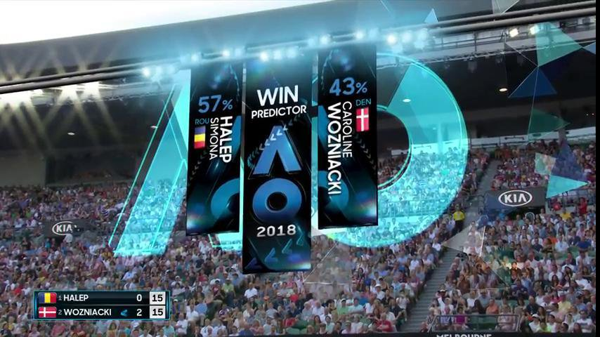
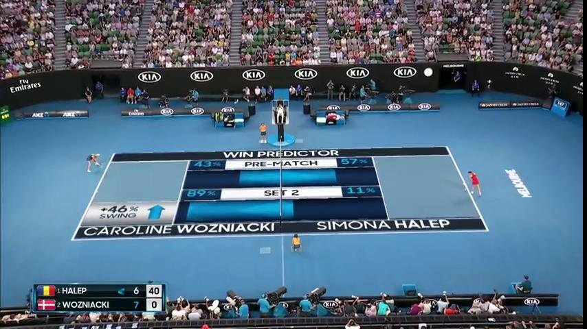
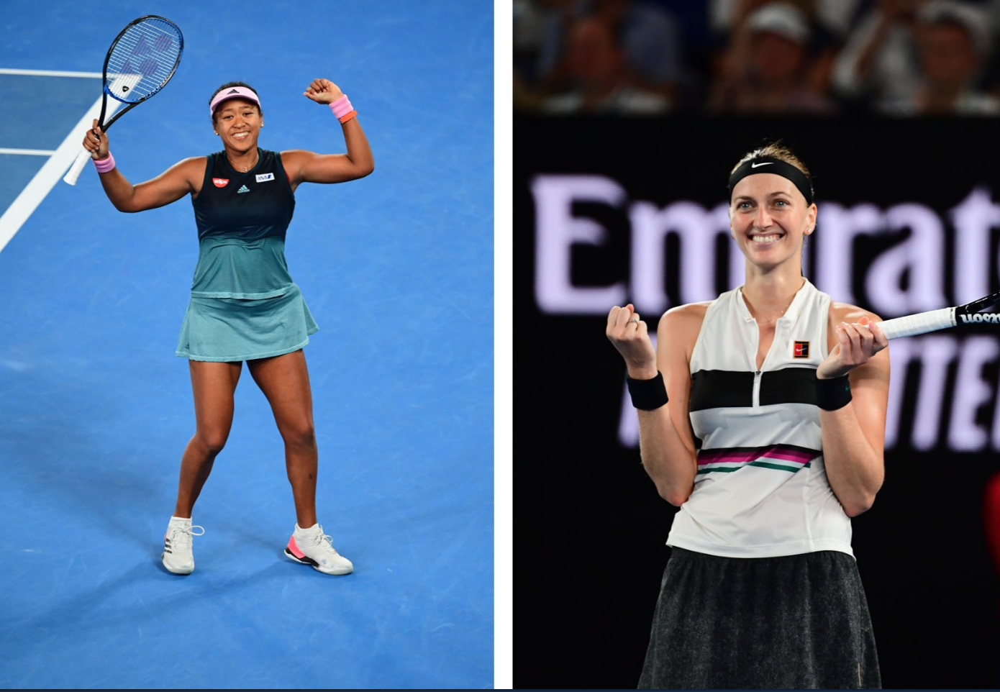
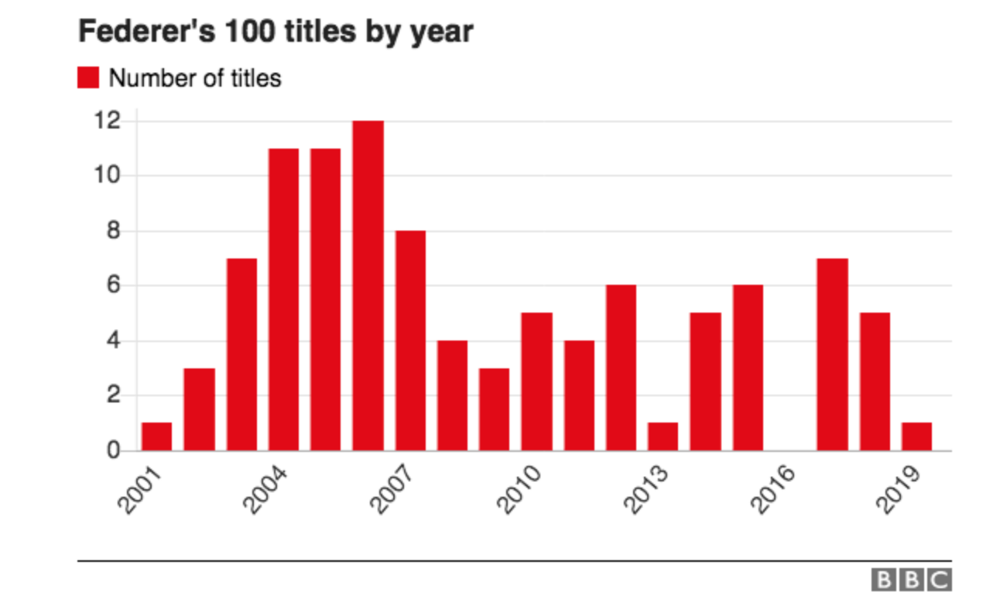
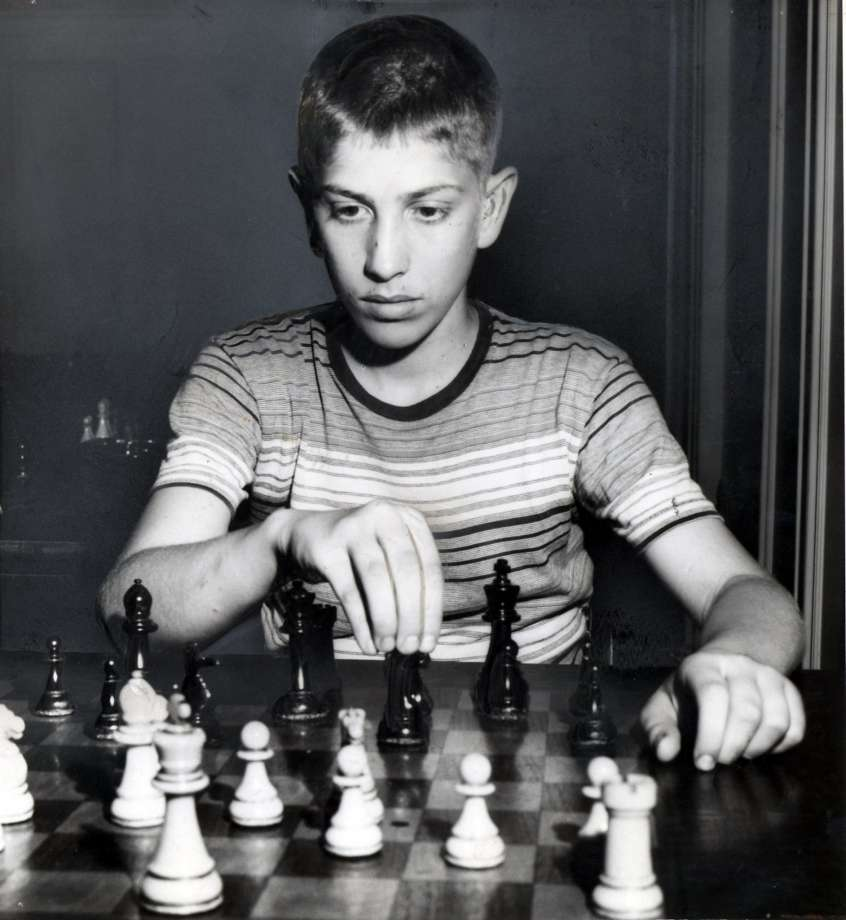
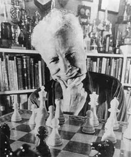
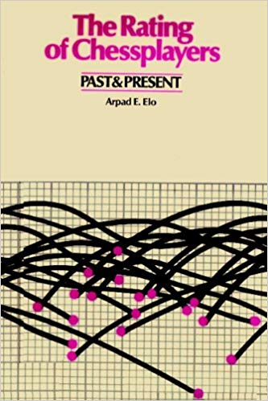
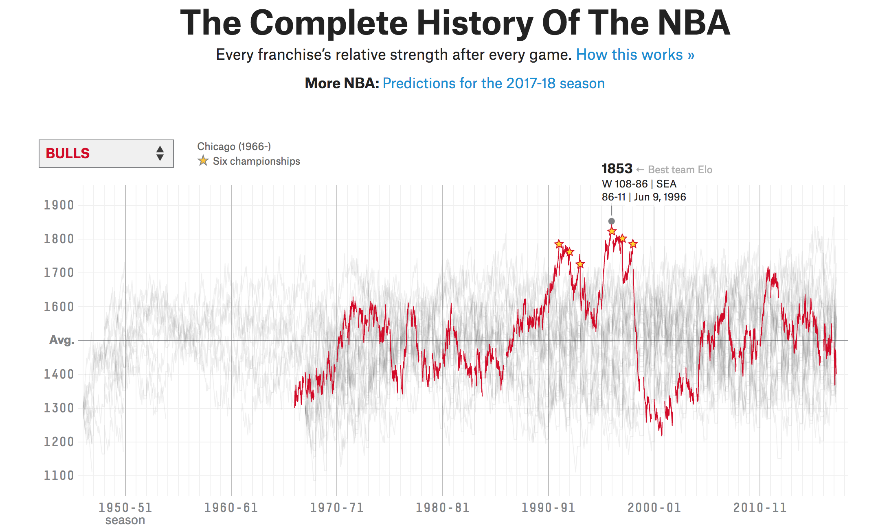
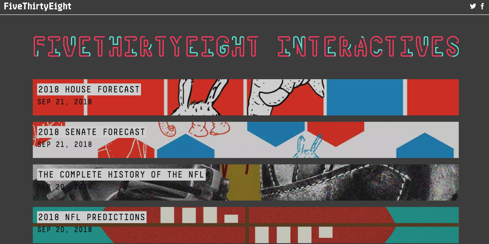

```{r setup, include=FALSE}
options(htmltools.dir.version = FALSE)

library(dplyr)
library(ggplot2)
library(ggthemes)
library(lubridate)
library(gganimate)
library(scales)

deminaur <- structure(list(DATE = structure(c(17169, 17176, 17177, 17182, 
17184, 17204, 17205, 17239, 17241, 17242, 17247, 17274, 17275, 
17314, 17330, 17337, 17379, 17381, 17382, 17383, 17384, 17386, 
17408, 17455, 17470, 17471, 17473, 17476, 17484, 17486, 17487, 
17531, 17534, 17536, 17537, 17540, 17541, 17542, 17543, 17544, 
17547, 17599, 17601, 17604, 17605, 17606, 17612, 17623, 17625, 
17626, 17627, 17628, 17651, 17653, 17659, 17660, 17662, 17663, 
17666, 17680, 17686, 17688, 17690, 17691, 17692, 17694, 17696, 
17697, 17698, 17699, 17708, 17715, 17717, 17719, 17729, 17735, 
17737, 17743, 17745, 17745, 17747, 17748, 17764, 17771, 17773, 
17775, 17799, 17801, 17802, 17803, 17807, 17808, 17813, 17814, 
17815, 17820, 17833, 17841, 17842, 17842, 17844, 17845, 17897, 
17898, 17900, 17903, 17905, 17906, 17908, 17908, 17910, 17912, 
17914, 17953, 17955), class = "Date"), NAME_T = c("Brisbane International - Brisbane", 
"Apia International - Sydney", "Apia International - Sydney", 
"Australian Open - Melbourne", "Australian Open - Melbourne", 
"Launceston Challenger", "Launceston Challenger", "Drummondville Challenger", 
"Drummondville Challenger", "Drummondville Challenger", "Guadalajara Challenger", 
"Qingdao Challenger", "Qingdao Challenger", "French Open - Paris", 
"Nottingham Challenger", "Ilkley Challenger", "Segovia Challenger", 
"Segovia Challenger", "Segovia Challenger", "Segovia Challenger", 
"Segovia Challenger", "Portoroz Challenger", "U.S. Open - New York", 
"Ismaning Challenger", "Eckental Challenger", "Eckental Challenger", 
"Eckental Challenger", "Mouilleron-Le-Captif Challenger", "Brescia Challenger", 
"Brescia Challenger", "Brescia Challenger", "Brisbane International - Brisbane", 
"Brisbane International - Brisbane", "Brisbane International - Brisbane", 
"Brisbane International - Brisbane", "Sydney International - Sydney", 
"Sydney International - Sydney", "Sydney International - Sydney", 
"Sydney International - Sydney", "Sydney International - Sydney", 
"Australian Open - Melbourne", "BNP Paribas Open - Indian Wells", 
"BNP Paribas Open - Indian Wells", "Irving Challenger", "Irving Challenger", 
"Irving Challenger", "Miami Open - Miami", "Alicante Challenger", 
"Alicante Challenger", "Alicante Challenger", "Alicante Challenger", 
"Alicante Challenger", "Millennium Estoril Open - Estoril", "Millennium Estoril Open - Estoril", 
"Braga Challenger", "Braga Challenger", "Braga Challenger", "Braga Challenger", 
"Lisbon Challenger", "French Open - Paris", "Surbiton Challenger", 
"Surbiton Challenger", "Surbiton Challenger", "Surbiton Challenger", 
"Surbiton Challenger", "Nottingham Challenger", "Nottingham Challenger", 
"Nottingham Challenger", "Nottingham Challenger", "Nottingham Challenger", 
"AEGON International - Eastbourne", "Wimbledon - London", "Wimbledon - London", 
"Wimbledon - London", "Hall of Fame Open - Newport", "BB&T Atlanta Open - Atlanta", 
"BB&T Atlanta Open - Atlanta", "Citi Open - Washington", "Citi Open - Washington", 
"Citi Open - Washington", "Citi Open - Washington", "Citi Open - Washington", 
"Winston-Salem Open - Winston-Salem", "U.S. Open - New York", 
"U.S. Open - New York", "U.S. Open - New York", "Shenzhen Open - Shenzhen", 
"Shenzhen Open - Shenzhen", "Shenzhen Open - Shenzhen", "Shenzhen Open - Shenzhen", 
"Rakuten Japan Open - Tokyo", "Rakuten Japan Open - Tokyo", "Shanghai Rolex Masters - Shanghai", 
"Shanghai Rolex Masters - Shanghai", "Shanghai Rolex Masters - Shanghai", 
"Intrum Stockholm Open - Stockholm", "BNP Paribas Masters - Paris", 
"Next Gen ATP Finals - Milan", "Next Gen ATP Finals - Milan", 
"Next Gen ATP Finals - Milan", "Next Gen ATP Finals - Milan", 
"Next Gen ATP Finals - Milan", "Brisbane International - Brisbane", 
"Brisbane International - Brisbane", "Brisbane International - Brisbane", 
"Sydney International - Sydney", "Sydney International - Sydney", 
"Sydney International - Sydney", "Sydney International - Sydney", 
"Sydney International - Sydney", "Australian Open - Melbourne", 
"Australian Open - Melbourne", "Australian Open - Melbourne", 
"Abierto Mexicano Telcel - Acapulco", "Abierto Mexicano Telcel - Acapulco"
), WINNERID = c(875L, 39309L, 13799L, 39309L, 4061L, 39309L, 
19689L, 39309L, 39309L, 40434L, 25372L, 39309L, 20819L, 6081L, 
8396L, 28992L, 39309L, 39309L, 39309L, 39309L, 31358L, 30470L, 
20650L, 6080L, 39309L, 39309L, 5129L, 11310L, 39309L, 39309L, 
10014L, 39309L, 39309L, 39309L, 12661L, 39309L, 39309L, 39309L, 
39309L, 22807L, 831L, 39309L, 6465L, 39309L, 39309L, 11178L, 
24225L, 39309L, 39309L, 39309L, 39309L, 1841L, 39309L, 20847L, 
39309L, 39309L, 39309L, 33648L, 36519L, 20847L, 39309L, 39309L, 
39309L, 39309L, 7043L, 39309L, 39309L, 39309L, 39309L, 39309L, 
9043L, 39309L, 39309L, 677L, 655L, 39309L, 5837L, 39309L, 39309L, 
39309L, 39309L, 24008L, 22807L, 39309L, 39309L, 6101L, 39309L, 
39309L, 39309L, 14727L, 39309L, 30470L, 39309L, 39309L, 24008L, 
678L, 468L, 39309L, 39309L, 39309L, 39309L, 30470L, 39309L, 39309L, 
3985L, 39309L, 39309L, 39309L, 39309L, 39309L, 39309L, 39309L, 
677L, 39309L, 24008L), PLAYER = c("Alex De Minaur", "Alex De Minaur", 
"Alex De Minaur", "Alex De Minaur", "Alex De Minaur", "Alex De Minaur", 
"Alex De Minaur", "Alex De Minaur", "Alex De Minaur", "Alex De Minaur", 
"Alex De Minaur", "Alex De Minaur", "Alex De Minaur", "Alex De Minaur", 
"Alex De Minaur", "Alex De Minaur", "Alex De Minaur", "Alex De Minaur", 
"Alex De Minaur", "Alex De Minaur", "Alex De Minaur", "Alex De Minaur", 
"Alex De Minaur", "Alex De Minaur", "Alex De Minaur", "Alex De Minaur", 
"Alex De Minaur", "Alex De Minaur", "Alex De Minaur", "Alex De Minaur", 
"Alex De Minaur", "Alex De Minaur", "Alex De Minaur", "Alex De Minaur", 
"Alex De Minaur", "Alex De Minaur", "Alex De Minaur", "Alex De Minaur", 
"Alex De Minaur", "Alex De Minaur", "Alex De Minaur", "Alex De Minaur", 
"Alex De Minaur", "Alex De Minaur", "Alex De Minaur", "Alex De Minaur", 
"Alex De Minaur", "Alex De Minaur", "Alex De Minaur", "Alex De Minaur", 
"Alex De Minaur", "Alex De Minaur", "Alex De Minaur", "Alex De Minaur", 
"Alex De Minaur", "Alex De Minaur", "Alex De Minaur", "Alex De Minaur", 
"Alex De Minaur", "Alex De Minaur", "Alex De Minaur", "Alex De Minaur", 
"Alex De Minaur", "Alex De Minaur", "Alex De Minaur", "Alex De Minaur", 
"Alex De Minaur", "Alex De Minaur", "Alex De Minaur", "Alex De Minaur", 
"Alex De Minaur", "Alex De Minaur", "Alex De Minaur", "Alex De Minaur", 
"Alex De Minaur", "Alex De Minaur", "Alex De Minaur", "Alex De Minaur", 
"Alex De Minaur", "Alex De Minaur", "Alex De Minaur", "Alex De Minaur", 
"Alex De Minaur", "Alex De Minaur", "Alex De Minaur", "Alex De Minaur", 
"Alex De Minaur", "Alex De Minaur", "Alex De Minaur", "Alex De Minaur", 
"Alex De Minaur", "Alex De Minaur", "Alex De Minaur", "Alex De Minaur", 
"Alex De Minaur", "Alex De Minaur", "Alex De Minaur", "Alex De Minaur", 
"Alex De Minaur", "Alex De Minaur", "Alex De Minaur", "Alex De Minaur", 
"Alex De Minaur", "Alex De Minaur", "Alex De Minaur", "Alex De Minaur", 
"Alex De Minaur", "Alex De Minaur", "Alex De Minaur", "Alex De Minaur", 
"Alex De Minaur", "Alex De Minaur", "Alex De Minaur", "Alex De Minaur", 
"Alex De Minaur"), MARGIN = c(0.118993135011442, 0.0685811696826646, 
0.126728110599078, 0.019565963614173, 0.199101123595506, 0.00735192120959915, 
0.0087619381407168, 0.19, 0.247386759581881, 0.0868735911219005, 
-0.0222734254992319, 0.0690317364059025, 0.224097331240188, 0.171052631578947, 
0.0158333333333334, 0.0508771929824561, 0.0317124735729387, 0.160030165912519, 
0.0348512247246424, 0.0194462755438365, 0.12280701754386, 0.169041201386215, 
0.218464841653247, 0.265151515151515, 0.110482654600302, 0.295575221238938, 
0.0842985842985843, 0.221554116558742, 0.0956521739130435, 0.130434782608696, 
-0.0293863439930856, 0.117424242424242, 0.0525941719971571, 0.251065643648764, 
-0.0567067530064755, 0.105461393596987, 0.244588744588745, 0.0572916666666666, 
0.101564722617354, 0.0454893943266036, 0.191345503718729, 0.0121183130032687, 
0.276595744680851, 0.119546027742749, 0.0205314009661836, 0.364864864864865, 
0.178234501347709, 0.107613666935701, 0.0662739322533137, 0.065418828762046, 
0.223728813559322, 0.140677966101695, 0.124253285543608, 0.110199004975124, 
0.0137195121951219, 0.00927232412819989, 0.089041095890411, 0.194077631052421, 
0.0400696864111498, 0.193563728598605, 0.225, 0.138792102206736, 
0.157429091855321, 0.0610328638497653, 0.0933333333333334, 0.135737704918033, 
0.148451198129749, 0.0168776371308017, 0.155888030888031, 0.0719752722990874, 
0.220795892169448, 0.103864734299517, 0.09401955146636, 0.191558441558442, 
0.00944669365721995, 0.0248949579831933, 0.229541734860884, 0.102313457152167, 
0.0999795542833776, 0.0916817359855334, -0.00165631469979299, 
0.201867816091954, 0.0928720687253308, 0.384012539184953, 0.124103419516264, 
0.00906398959988441, 0.340659340659341, 0.0536863394006252, 0.0775, 
-0.0637589621031068, 0.0395641363170981, 0.110781855482106, 0.0333333333333333, 
0.0600000000000001, 0.21, 0.0611522911051212, 0.0121381886087769, 
0.205856255545697, 0.15, 0.0772490221642764, 0.103908955962395, 
0.0848648648648649, 0.271950640721405, 0.165816326530612, 0.140341321713871, 
0.0841990158556588, 0.128947368421053, 0.115409836065574, 0.191323692992214, 
0.0363202545068929, 0.0650502661147251, 0.0233669086061324, 0.169234531670335, 
0.0705128205128205, 0.0909090909090909), ELO_STD = c(1555.78965505767, 
1577.91083218635, 1570.66944429257, 1592.64978785055, 1581.65231103674, 
1598.3770684065, 1580.28605415273, 1594.00431079284, 1608.73704264986, 
1586.96832130692, 1571.27679428467, 1588.59384635706, 1566.05826663261, 
1555.67535460148, 1535.75955886849, 1517.25142234573, 1537.33967124659, 
1549.4333569622, 1563.83900895044, 1583.54888650705, 1563.64632619207, 
1545.52311211275, 1542.70105790331, 1522.24792662878, 1543.96800921399, 
1563.97376757609, 1551.27293489202, 1537.4148086542, 1552.22940612442, 
1565.6380550351, 1552.75525981238, 1578.00068457593, 1607.64174124717, 
1624.98341573071, 1615.22431887977, 1639.40048751412, 1639.40048751412, 
1663.46713953088, 1684.50760655411, 1672.57743895984, 1664.70704001783, 
1683.80142350766, 1680.78299600187, 1700.35446136982, 1715.07445150488, 
1700.78053676177, 1683.64975250801, 1693.65501918771, 1701.69454095208, 
1715.44661929651, 1728.20975438977, 1708.79512688246, 1721.01602162071, 
1710.98149413418, 1718.30643947151, 1723.53789266803, 1732.26750009285, 
1710.93265181046, 1685.91625966718, 1677.53207786896, 1683.07503164485, 
1703.975262884, 1720.61203764984, 1735.67145355276, 1722.0156251301, 
1736.12370794815, 1745.08626675967, 1752.0769978019, 1764.27423947558, 
1780.31793929607, 1758.7412547194, 1781.53282992309, 1797.88283545989, 
1795.74195340464, 1773.57155443517, 1784.96198608744, 1775.73922050399, 
1787.8458514521, 1805.71535497658, 1826.65473322145, 1842.82210255392, 
1836.0592330502, 1817.20125365515, 1832.36068734181, 1850.71170147599, 
1841.35178754048, 1846.92523221014, 1856.0632469049, 1867.16527089874, 
1845.41175357625, 1860.69712480688, 1844.72657219791, 1853.15985067161, 
1865.81682402164, 1855.89656508035, 1838.07796674865, 1818.28370032567, 
1822.06336486028, 1834.18508100157, 1845.98050087811, 1853.71408390978, 
1841.8007823221, 1847.65776101752, 1859.29865553958, 1844.82023978963, 
1858.753952966, 1870.23416295558, 1881.62913118804, 1897.04312173813, 
1908.52729544825, 1916.16108173661, 1919.74456457156, 1915.5257488547, 
1921.67045421375, 1912.0250009186), ELO = c(1573.72231354616, 
1601.56431726528, 1593.06153161557, 1616.80332578184, 1596.79725701428, 
1613.03713769581, 1596.53627002984, 1621.82245355444, 1653.59000470376, 
1621.2400113204, 1611.42648126411, 1631.03629043128, 1589.15389364636, 
1573.34907381237, 1552.24452617275, 1529.88055180079, 1552.5353848657, 
1569.40269544092, 1582.68114825553, 1605.40031734674, 1578.62480725143, 
1552.12246311342, 1547.32731073023, 1505.82980723895, 1540.84791062708, 
1582.10152414018, 1571.3029922541, 1546.70803865212, 1566.44915814656, 
1584.10176615365, 1578.52588738725, 1613.709432353, 1653.76366665579, 
1685.14274671731, 1683.36852374962, 1718.40453489364, 1718.40453489364, 
1742.99559840914, 1769.20311135565, 1755.5733649794, 1733.51384679478, 
1748.1998696263, 1733.92317274357, 1759.98791930141, 1771.32489023551, 
1731.19567719742, 1701.76932037327, 1711.21727026, 1715.48000749878, 
1734.52360473589, 1760.25654768534, 1731.76780788705, 1745.62348619311, 
1735.28866399977, 1733.53701495584, 1728.0559904194, 1736.72312975281, 
1703.37231529321, 1673.12975650423, 1661.75247458343, 1674.98471177036, 
1707.10917760138, 1734.44093565332, 1751.41346155991, 1734.45754303275, 
1755.38516379198, 1770.60595630585, 1769.26150117154, 1790.31504793089, 
1806.59526022358, 1769.05705736334, 1801.26133447188, 1820.68000966374, 
1820.39749216821, 1797.29177444086, 1808.68141302797, 1789.78740554567, 
1803.74341777958, 1827.93960769695, 1852.95863898614, 1865.97323646272, 
1852.01194181722, 1824.06981147491, 1867.92415921259, 1891.72174007738, 
1892.19484846703, 1911.65442560489, 1913.91299861973, 1921.13595854743, 
1901.19188930446, 1917.78453687067, 1892.67387330365, 1893.19530543641, 
1903.55607960301, 1882.9974310964, 1861.26429646669, 1838.37295639643, 
1843.21048062474, 1862.32318959794, 1873.15016032715, 1882.37777786332, 
1867.53599516976, 1882.99961974636, 1905.40346825748, 1879.4647045038, 
1892.51255462779, 1908.00329860454, 1924.54155216258, 1953.23640595812, 
1960.31863635877, 1963.22893316762, 1948.8275043343, 1937.92708123229, 
1938.39959661348, 1927.33533497763)), row.names = c(NA, -115L
), class = "data.frame")
```

class: center, middle


---
class: center, middle



---
class: center, middle




---
class: center, middle

# How Do We Pick Winners?



---


# Paired Comparisons

--

- Suppose we could measure a player's ability relative to all other players

--

- Call this ability, $\delta$

--

- The bigger $\delta$ is the better

--

- Now, suppose player $A$ and player $B$ have an upcoming match

--

- What properties of $\delta_A$ and $\delta_B$ would make us favour one competitor over another?


---

# Bradely-Terry Model

--

- This kind of comparison of abilities is a paired comparison

--

- Although we don't observe player _ability_ directly, we can attempt to estimate it based on the results of head-to-head competitions

--

- A common model-based strategy for estimating abilities is the Bradley-Terry model 

--

- In this model, player $A$'s chance of winning takes the logistic form, 

$$
P(Win_{A} = 1) = \frac{\exp{(\delta_A - \delta_B)}}{1 + \exp{(\delta_A - \delta_B)}}
$$

---

# Bradley-Terry Win Curve

With this model, outcomes are all about the relative difference in player abilities. And those relative differences are considered constant over the period considered.

```{r echo = FALSE, fig.align='center', fig.width = 4, fig.height = 4}
BT <- function(delta){
  exp(delta) / (1 + exp(delta))
}

data <- data.frame(
  ability = seq(-3, 3, by = 0.1),
  p = BT(seq(-3, 3, by = 0.1))
)

gg1 <- data %>%
ggplot(aes(y = p * 100, x = ability)) +
  theme_hc() + 
  geom_hline(yintercept = 50, col = "darkgrey", alpha = 0.5) + 
  geom_line(size = 2, col = "#e10a17") +
  scale_y_continuous("WIN CHANCE", breaks = scales::pretty_breaks(n = 6)) + 
  scale_x_continuous("ABILITY DIFFERENCE", breaks = scales::pretty_breaks(n = 6)) +
  theme(text = element_text(size = 16))

gg1 <- gg1 + transition_reveal(ability)

animate(gg1, renderer = gifski_renderer(loop = F), width = 300, height = 300)
```

<br>

Note: You can fit these models in R with the `BradleyTerry2` package.

---
class: center, middle

# But Abilities Aren't Fixed!



---

# Bobby Fischer

.pull-left[

]

--

.pull-right[
```{r echo = F}
# Source: chessmetrics
fischer_rating <- data.frame(
  rating = c(2454,
2454,
2452,
2475,
2493,
2512,
2531,
2546,
2558,
2557,
2567,
2577,
2603,
2611,
2620,
2614,
2614,
2614,
2613,
2612,
2612,
2604,
2657,
2664,
2666,
2666,
2685,
2680,
2680,
2668,
2687,
2701,
2699,
2700,
2700,
2693,
2699,
2700,
2701,
2701,
2702,
2701,
2720,
2720,
2716,
2702,
2701,
2702,
2717,
2717,
2727,
2729,
2729,
2728,
2727,
2731,
2730,
2732,
2730,
2745,
2744,
2741,
2738,
2739,
2755,
2761,
2761,
2760,
2761,
2760,
2760,
2755,
2756,
2757,
2752,
2758,
2758,
2759,
2757,
2757,
2757,
2765,
2765,
2765,
2763,
2759,
2788,
2790,
2790,
2790,
2791,
2783,
2784,
2784,
2783,
2779,
2776,
2776,
2774,
2772,
2768,
2765,
2764,
2761,
2758,
2753,
2748,
2745,
2743,
2747,
2744,
2744,
2744,
2751,
2752,
2752,
2752,
2730,
2773,
2772,
2802,
2804,
2805,
2803,
2803,
2807,
2803,
2799,
2797,
2798,
2798,
2797,
2809,
2804,
2801,
2801,
2801,
2800,
2798,
2796,
2795,
2794,
2790,
2798,
2797,
2795,
2795,
2796,
2796,
2796,
2795,
2794,
2793,
2794,
2793,
2791,
2789,
2787,
2788,
2783,
2778,
2797,
2819,
2810,
2808,
2827,
2826,
2825,
2827,
2834,
2850,
2850,
2848,
2847,
2846,
2867,
2869,
2895,
2894,
2895,
2894,
2895,
2893,
2894,
2892,
2891,
2886,
2884,
2882,
2880,
2872,
2870,
2866,
2865,
2865,
2863),
  age = c(13.66666667,
13.75,
13.83333333,
13.91666667,
14,
14.08333333,
14.16666667,
14.25,
14.33333333,
14.41666667,
14.5,
14.58333333,
14.66666667,
14.75,
14.83333333,
14.91666667,
15,
15.08333333,
15.16666667,
15.25,
15.33333333,
15.41666667,
15.5,
15.58333333,
15.66666667,
15.75,
15.83333333,
15.91666667,
16,
16.08333333,
16.16666667,
16.25,
16.33333333,
16.41666667,
16.5,
16.58333333,
16.66666667,
16.75,
16.83333333,
16.91666667,
17,
17.08333333,
17.16666667,
17.25,
17.33333333,
17.41666667,
17.5,
17.58333333,
17.66666667,
17.75,
17.83333333,
17.91666667,
18,
18.08333333,
18.16666667,
18.25,
18.33333333,
18.41666667,
18.5,
18.58333333,
18.66666667,
18.75,
18.83333333,
18.91666667,
19,
19.08333333,
19.16666667,
19.25,
19.33333333,
19.41666667,
19.5,
19.58333333,
19.66666667,
19.75,
19.83333333,
19.91666667,
20,
20.08333333,
20.16666667,
20.25,
20.33333333,
20.41666667,
20.5,
20.58333333,
20.66666667,
20.75,
20.83333333,
20.91666667,
21,
21.08333333,
21.16666667,
21.25,
21.33333333,
21.41666667,
21.5,
21.58333333,
21.66666667,
21.75,
21.83333333,
21.91666667,
22,
22.08333333,
22.16666667,
22.25,
22.33333333,
22.41666667,
22.5,
22.58333333,
22.66666667,
22.75,
22.83333333,
22.91666667,
23,
23.08333333,
23.16666667,
23.25,
23.33333333,
23.41666667,
23.5,
23.58333333,
23.66666667,
23.75,
23.83333333,
23.91666667,
24,
24.08333333,
24.16666667,
24.25,
24.33333333,
24.41666667,
24.5,
24.58333333,
24.66666667,
24.75,
24.83333333,
24.91666667,
25,
25.08333333,
25.16666667,
25.25,
25.33333333,
25.41666667,
25.5,  
25.58333333,
25.66666667,
25.75,
25.83333333,
25.91666667,
26,
26.08333333,
26.16666667,
26.25,
26.33333333,
26.41666667,
26.5,
26.58333333,
26.66666667,
26.75,
26.83333333,
26.91666667,
27,
27.08333333,
27.16666667,
27.25,
27.33333333,
27.41666667,
27.5,
27.58333333,
27.66666667,
27.75,
27.83333333,
27.91666667,
28,
28.08333333,
28.16666667,
28.25,
28.33333333,
28.41666667,
28.5,
28.58333333,
28.66666667,
28.75,
28.83333333,
28.91666667,
29,
29.08333333,
29.16666667,
29.25,
29.33333333,
29.41666667,
29.5,
29.58333333,
29.66666667,
29.75,
29.83333333,
29.91666667)
)

gg1 <- fischer_rating %>%
ggplot(aes(y = rating, x = age)) +
  theme_hc() + 
  geom_line(size = 0.5, col = "#e10a17") +
  geom_point(size = 3, col = "#e10a17") +
  scale_y_continuous("RATING", breaks = scales::pretty_breaks(n = 10)) + 
  scale_x_continuous("AGE", breaks = scales::pretty_breaks(n = 10)) +
  theme(text = element_text(size = 16))

gg1
```
]

---

# Arpad Elo

.pull-left[

]

.pull-right[

]

---

# Elo's Solution

Treat player abilities as a moving target.

```{r echo = F, fig.align = "center", fig.width = 6, fig.height = 4}
gg1 <- gg1 + transition_reveal(age)

animate(gg1, renderer = gifski_renderer(loop = F), width = 720, height = 480)
```

---
class: center, middle




---

# Elo, Elo, Everywhere!




Source: https://data.fivethirtyeight.com/

---

# How Elo Works 

The standard Elo system is an algorithm with two steps:

<u>E-Step:</u> 

Sets *E*xpectations for an upcoming match given the current ratings of competitors

--

<u>U-Step:</u>

*U*pdates ratings given the result and how much the result deviated from expectations

---

# Standard Elo E-Step

Expectations are for the win result and follow a logistic curve. 

$$\hat{W}_{ij} = \frac{1}{1 + 10^{(R_j - R_i)/\sigma}}$$

--

- $R_i$ the rating of the $i$th player

--

- $\sigma = 400$ in the standard Elo system (2 SD of ratings)

---

# E-Step in Action

```{r}
elo_estep <- function(r1, r2, sigma = 400){
  1/(1 + 10^((r2-r1) / sigma))
}

elo_estep(r1 = 2000, r2 = 1900)
```

---

```{r fig.align = "center"}
curve(elo_estep(x, r2 = 1800), 
        from = 1600,  to = 2400,
        lwd = 2,
        col = "red", 
        ylab = "Player 1 Win Prediction",
        xlab = "Player 1 Rating")
```

---

# Standard Elo U-Step

$$\tilde{R}_i = R_i + K (W_{ij} - \hat{W}_{ij})$$

--

- $W_{ij}$ is a 0 or 1 indicator of player $i$ winning against player $j$

--

- $K$ a constant learning rate (or attenuation factor)

--

- Initial rating is set to some 'average' player, often $R_0 = 1500$

---

# U-Step in Action

```{r echo = F, fig.align = "center", fig.retina = 3}
params <- expand.grid(
  K = c(1, 5, 10, 20),
  hatW = seq(0, 1, by = 0.1),
  W = c(0, 1)
)

params %>%
  ggplot(aes(y = hatW, x = factor(K))) + 
  geom_tile(aes(fill = K * (W - hatW))) +
  facet_wrap(~factor(W, labels = c("Lost", "Won"))) + 
  scale_fill_gradient2(low = "red", high = "blue") + 
  scale_y_continuous("Win Expectation") +
  scale_x_discrete("K (Learning Rate)") +
  theme_hc() +
  theme(text = element_text(size = 16))
```

---

# Elo Rating of Alex De Minaur


```{r echo = F, fig.align = "center", fig.width = 10, fig.height = 6, fig.retina=3}
# Highlight Sydney 2018
deminaur <- deminaur %>%
    dplyr::mutate(
      SYDNEY = grepl("Sydney", ignore = T, NAME_T)
    )

deminaur %>%
    ggplot(aes(y = ELO_STD, x = DATE, col = SYDNEY)) +
    geom_point() + 
    theme_hc() +
    scale_colour_tableau("Classic Blue-Red 6", name = "SYDNEY") +
    scale_y_continuous("STANDARD ELO") +
    scale_x_date("", date_breaks = "3 months", date_labels = "%b %y") +
    theme(text = element_text(size = 16))
```

---

# A Win is a Win? 

```{r echo = F, fig.align="center", fig.retina=3}
sydney_2018 <- data.frame(
  round = 1:5,
  opponent_rank = c(40, 30, 36, 42, 84),
  game_margin = c(6, 7, 4, 8, 1),
  win = factor(c(1, 1, 1, 1, 0), levels = 0:1, labels = c("LOST", "WON"), order = T)
)

sydney_2018 %>%
  ggplot(aes(y = game_margin, x = round, col = win)) + 
  geom_segment(aes(yend = game_margin, y = 0, xend = round), size = 1) + 
  geom_point(size = 6) +
  geom_hline(yintercept = 0, col = "red", size = 2, alpha = 0.5) +
  scale_y_continuous("GAME MOV", lim = c(-8, 8), breaks = scales::pretty_breaks(n = 10)) +
  scale_x_continuous("", breaks = 1:5, labels = c("R32", "R16", "QF", "SF", "F")) +
  theme_hc() + 
  theme(text = element_text(size = 16)) +
  scale_colour_tableau("Classic Blue-Red 12", name = "") +
  ggtitle("Alex De Minaur's Breakout in Sydney 2018")
```

---

# Accounting for Margin of Victory

.pull-left[
<br>
- Standard Elo ignores the _strength_ of wins. 

- But what if the 'how' of a win tells us more about player ability than the win alone?
]

.pull-right[

]


---

# Margin Of Victory Elo Models

--

- Linear

--

- Joint Additive

--

- Multiplicative

--

- Logistic

---

# Linear

<u>E-Step</u>

$$\hat{M}_{ij} = \frac{R_i - R_j}{\sigma}$$

--

<u>U-Step</u>

$$\tilde{R}_i = R_i + K (M_{ij} - \hat{M}_{ij})$$

---


# Joint Additive

<u>E-Step</u>

$$\hat{M}_{ij} = \frac{R_i - R_j}{\sigma_1}$$

$$\hat{W}_{ij} = \frac{1}{1 + 10^{(R_j - R_i)/\sigma_2}}$$

--

<u>U-Step</u>

$$\tilde{R}_i = R_i + K_1 (M_{ij} - \hat{M}_{ij}) + K_2 (W_{ij} - \hat{W}_{ij})$$

---

# Multiplicative


<u>E-Step</u>


$$\hat{M}_{ij} = \frac{R_i - R_j}{\sigma_1}$$

$$\hat{W}_{ij} = \frac{1}{1 + 10^{(R_j - R_i)/\sigma_2}}$$
--

<u>U-Step</u>

$$\tilde{R}_i = R_i + \frac{K}{1 + \alpha^{-|M_{ij} - \hat{M}_{ij}|}} (W_{ij} - \hat{W}_{ij})$$
$\alpha > 1$

---


# Logistic


<u>E-Step</u>

$$
\hat{W}_{ij} = \frac{1}{1 + 10^{(R_j - R_i)/\sigma_2}}
$$
--

<u>U-Step</u>

$$\tilde{R}_i = R_i + K (\frac{1}{1 + \alpha^{M_{ji}/\sigma_1}} - \hat{W}_{ij})$$

$\alpha > 1$

---

# The ELO MOV R Package 

```{r eval = F}
devtools::install_github("GIGTennis/elomov")
```

--

```{r eval = F}
library(elomov)

example(linear) 
```
--

```{r eval = F}
ratings <- linear(
           ~ winner, 
           ~ loser, 
           ~ game_margin,
           data = atp_games, 
           k.margin = 3,  
           scale.margin = 75)
```

---
class: center, middle

```{r warning = F, message = F, echo = F}
library(elomov)

ratings <- linear(
           ~ winner, 
           ~ loser, 
           ~ game_margin,
           data = atp_games, 
           k.margin = 3,  
           scale.margin = 75)
```


```{r echo = F, fig.width = 8, fig.align = "center", fig.retina=3}
ratings <- cbind(atp_games, ratings[,c("winner_elo", "loser_elo")])

ratings <- ratings %>% filter(winner == "Novak Djokovic" | loser == "Novak Djokovic") %>%
  dplyr::mutate(
    won_match = winner == "Novak Djokovic",
    game_margin = ifelse(won_match, game_margin, -1 * game_margin)
  )

djokovic <- rbind(
  ratings %>% rename(player = winner, opponent = loser, elo = winner_elo) %>% select(-loser_elo),
  ratings %>% rename(player = loser, opponent = winner, elo = loser_elo) %>% select(-winner_elo)
)

djokovic <- djokovic %>% filter(player == "Novak Djokovic") %>% arrange(match_date)

example <- djokovic[1:5,]
example$update <- c(example$elo[1] - 1500, diff(example$elo))
example$won_match <- factor(example$won_match, labels = c("LOST", "WON"), order = T)

gg1 <-  example %>%
  ggplot(aes(y = update, x = match_date, size = game_margin, col = won_match)) +
  theme_hc() + 
  geom_text(aes(label = opponent), size = 5, nudge_y = 5, nudge_x = -0.6, show.legend = F) +
  geom_line(size = 0.5, col = "darkgrey") +
  geom_point() +
  scale_colour_tableau("Traffic", name = "") +
  scale_y_continuous("RATING", breaks = scales::pretty_breaks(n = 10)) + 
  scale_x_date("", date_breaks = "1 day", date_labels = "%m-%d") + 
  theme(text = element_text(size = 16)) +
  ggtitle("Novak Djokovic", subtitle = "Australian Open 2014")

gg1 <- gg1 + transition_reveal(match_date)

animate(gg1, renderer = gifski_renderer(loop = F), width = 720, height = 480)
```

---

# What Makes a Good MOV?

--

- Strongly related to the win result

--

- Scales linearly with difference in competitor ability

--

- Is generally available 

---

# Simpson's Paradox in Tennis

2018 Sydney Men's Final

```{r echo = F}
tab <- data.frame(
   `Margin Of Victory` = c("MATCH WIN", "GAMES WON", "SERVICE POINTS WON", "BREAK POINTS WON"),
  `Alex De Minaur` = c("Loser", "+1", "-1", "+1"),
    `Daniil Medvedev` = c("Winner", "-1", "+1", "-1")
)

htmlTable::htmlTable(tab[1,], rnames = F, 
                     header = c("", "Alex De Minaur", "Daniil Medvedev"),
                     css.table = "width:90%;",
                     css.cgroup = "width:30%;")
```
<br>
<br>

--

```{r echo = F}
htmlTable::htmlTable(tab[-1,], 
                     rnames = F, 
                     header = c("Margin of Victory", "Alex De Minaur", "Daniil Medvedev"),
                     css.table = "width:90%;")
```


---

# Margin of Victory Variables


```{r echo = F}
tab <- data.frame(
  `Margin Of Victory` = c("SETS WON", "GAMES WON", "BREAK POINTS WON", "TOTAL POINTS WON", "SERVE PERCENTAGE WON"),
  `Median` = c(2, 5, 2, 14, 10),
    `IQR` = c(1, 4, 2, 10, 12),
    `Freq. Positive for Winner` = c(100, 95, 90, 94, 93)
)

htmlTable::htmlTable(tab, rnames = F, header = c("Margin Of Victory", "Median", "IQR", "% Positive for Winner"))
```


---

# Which is Best?

.pull-left[

]

.pull-right[
- We want the MOV variable and model that will help us set more accurate expectations about future performance 

- So we optimise (_K_, $\sigma$, $\alpha$) for accuracy

- Then apply to new data to test model performance against each other
]

---

# MOV Parameter Scale

Standard Elo yields ratings with a SD of ~200. To maintain that property in the MOV models...

--

-  $\sigma \approx 200 / SD_{MOV}$ in the E-Step

--

- $K \approx 10 / SD_{MOV}$ in the U-Step


---


# Performance Comparison

```{r echo = F, fig.width = 12, fig.height = 7, fig.retina=3, fig.align="center"}
tier <- c("Challenger", "ATP 250", "ATP 500", "ATP Masters", "Grand Slams")

model1 <- data.frame(
	mov =  rep(c("Sets Won", "Games Won", "Break Points Won", "Total Points Won", "Serve Percent Won"), each = 5),
	tier = tier,
	accuracy = c(62.2, 62.6, 66.5, 67.3, 74.5, 62.3, 61.7, 65.9, 66.5, 74.1, 63.2, 62.0, 65.9, 66.4, 74.0, 63.3, 62.0, 66.7, 66.9, 73.4, 63.3, 61.5, 65.6, 66.8, 73.7),
	accuracy_lower = c(61.2, 60.6, 63.4, 64.2, 71.7, 61.4, 59.5, 63.0, 63.8, 71.4, 62.1, 59.9, 62.8, 63.7, 71.3, 62.3, 60.0, 63.5, 64.0, 70.7, 62.4, 59.5, 62.3, 64.1, 71.0),
	accuracy_upper = c(63.2, 64.8, 69.4, 70.2, 77.4, 63.4, 63.6, 68.9, 69.4, 76.9, 64.2, 64.0, 69.1, 69.1, 76.7, 64.3, 64.1, 69.6, 69.4, 76.3, 64.3, 63.7, 68.7, 69.6, 76.5),
	stringsAsFactors = F
)

model2 <- data.frame(
	mov =  rep(c("Sets Won", "Games Won", "Break Points Won", "Total Points Won", "Serve Percent Won"), each = 5),
	tier = tier,
	accuracy = c(62.5, 62.2, 67.6, 67.2, 75.6, 62.7, 62.4, 67.5, 67.8, 75.5, 63.0, 62.4, 68.1, 68.1, 75.7, 63.0, 62.0, 67.6, 67.9, 75.5, 63.0, 61.6, 67.9, 67.5, 75.3),
	accuracy_lower = c(61.7, 60.4, 65.3, 64.9, 73.4, 61.9, 60.8, 65.0, 65.5, 73.3, 62.2, 60.6, 65.5, 65.9, 73.4 , 62.2, 60.3, 65.2, 65.7, 73.5, 62.2, 59.8, 65.5, 65.3, 73.0),
	accuracy_upper = c(63.3, 63.9, 70.2, 69.5, 77.9, 63.6, 64.0, 70.0, 70.1, 77.8, 63.8, 64.2, 70.4, 70.4, 77.8, 63.8, 63.7, 70.1, 70.0, 77.6, 63.8, 63.1, 70.4, 69.6, 77.4),
	stringsAsFactors = F
)	


model3 <- data.frame(
	mov =  rep(c("Sets Won", "Games Won", "Break Points Won", "Total Points Won", "Serve Percent Won"), each = 5),
	tier = tier,
	accuracy = c(62.4, 61.8, 66.8, 67.5, 75.0, 62.7, 61.8, 67.8, 67.3, 74.8, 62.5, 61.9, 67.9, 67.3, 75.0, 62.3, 61.7, 67.4, 67.3, 75.0, 62.5, 61.9, 67.8, 67.3, 75.2),
	accuracy_lower = c(61.7, 60.1, 64.5, 65.2, 72.6, 61.9, 60.1, 65.4, 65.1, 72.4, 61.6, 60.2, 65.4, 64.9, 72.8, 61.5, 60.1, 65.0, 64.9, 72.8, 61.7, 60.1, 65.1, 65.0, 73.1),
	accuracy_upper = c(63.2, 63.4, 69.4, 69.7, 77.1, 63.4, 63.5, 70.3, 69.5, 77.1, 63.2, 63.6, 70.4, 69.8, 77.1, 63.1, 63.3, 69.7, 69.5, 77.1, 63.3, 63.6, 70.2, 69.4, 77.3),
	stringsAsFactors = F
)	

model4 <- data.frame(
	mov =  rep(c("Sets Won", "Games Won", "Break Points Won", "Total Points Won", "Serve Percent Won"), each = 5),
	tier = tier,
	accuracy = c(62.6, 61.9, 67.5, 66.9, 75.0, 62.9, 61.7, 68.0, 67.9, 75.0, 63.0, 61.9, 68.3, 68.3, 75.4, 63.1, 61.8, 67.2, 68.2, 75.0, 63.2, 62.0, 67.6, 68.0, 74.6),
	accuracy_lower = c(61.8, 60.2, 65.0, 64.7, 72.8, 62.0, 59.8, 65.4, 65.7, 72.5, 62.2, 60.3, 65.7, 66.1, 73.1, 62.3, 60.2, 64.7, 65.8, 72.7, 62.4, 60.3, 65.2, 65.8, 72.5),
	accuracy_upper = c(63.4, 63.4, 70.0, 69.1, 77.3, 63.6, 63.4, 70.5, 70.2, 77.2, 63.7, 63.6, 70.8, 70.5, 77.5, 63.8, 63.5, 69.8, 70.3, 77.3, 64.0, 63.6, 69.9, 70.2, 77.0),
	stringsAsFactors = F
)	

model1$Model <- "Linear"
model2$Model <- "Joint Additive"
model3$Model <- "Multiplicative"
model4$Model <- "Logistic"

models <- rbind(model1, model2, model3, model4)
models$tier <- factor(models$tier, levels = tier, order = T)
models$Model <- factor(models$Model, levels = c("Linear", "Joint Additive", "Multiplicative", "Logistic"), order = T)
models$mov <- factor(models$mov, levels = c("Sets Won", "Games Won", "Break Points Won", "Total Points Won", "Serve Percent Won"), order = T)

standard <- data.frame(
	tier = tier,
	accuracy = c(62.3, 61.7, 65.9, 66.5, 74.1)
)

standard$tier <- factor(standard$tier, levels = tier, order = T)
	
results <- models %>%
	ggplot(aes(y = accuracy, ymin = accuracy_lower, ymax = accuracy_upper, x = tier, col = Model, group = Model)) +
	geom_hline(data = standard, aes(yintercept = accuracy), col = "darkgrey", size = 2, alpha = 0.5) + 
	geom_pointrange(size = 0.5, position = position_dodge(width = 0.8)) + 
	scale_colour_tableau(name = "") + 
	facet_grid(. ~ mov) +
	theme_hc() +
	scale_y_continuous("Win Prediction Accuracy") +
	scale_x_discrete("") + 
	theme(
		legend.position = "top",
		axis.text.x = element_text(angle = 90),
		text = element_text(size = 16)
	)

results
```

---

# Takeaways

--

- Most MOV models can improve predictions about win results

--

- Accuracy increases with the level of the event

--

- Improving predictions at the lowest-level events is difficult

--

- The joint additive model with serve percent won as the MOV has a lot to like

---


# Alex De Minaur MOV Rating

```{r echo = F, fig.align="center", fig.width = 9, fig.height = 5, fig.retina=3}
deminaur$MARGIN <- ifelse(deminaur$WINNERID == 39309, deminaur$MARGIN, -1 * deminaur$MARGIN)
deminaur$ELO_STD <- (deminaur$ELO_STD - deminaur$ELO_STD[1]) +  deminaur$ELO[1]
deminaur$ORDER <- 1:nrow(deminaur)

plot <- deminaur %>%
    ggplot(aes(y = ELO_STD, x = ORDER)) +
    geom_point(col = "darkgrey") + geom_line(col = "darkgrey",  alpha = 0.5) +
    geom_point(aes(y = ELO, col = MARGIN * 100, group = ORDER), size = 3) + geom_line(aes(y = ELO, col = MARGIN * 100), alpha = 0.5) +
    theme_hc() +
    scale_colour_gradient(name = "SERVE PERCENT MOV", low = "red", high = "green") +
    scale_y_continuous("ELO RATING") +
    scale_x_continuous("") +
    ggtitle("Seasons 2017 to 2019")

plot <- plot + transition_reveal(ORDER)

animate(plot, renderer = gifski_renderer(loop = F), width = 720, height = 480)
```


---


# Future Work

--

- Adjustments for match conditions

--

- Absence from play corrections

--

- Fully model-based analogs to allow for formal inference about ratings and predictions

---

# Resources

- Slides [github.com/GIGTennis/MonashEBS](github.com/GIGTennis/MonashEBS)

- ELO MOV Package [github.com/GIGTennis/elomov](github.com/GIGTennis/elomov)

- On the T Blog [on-the-t.com](on-the-t.com)


